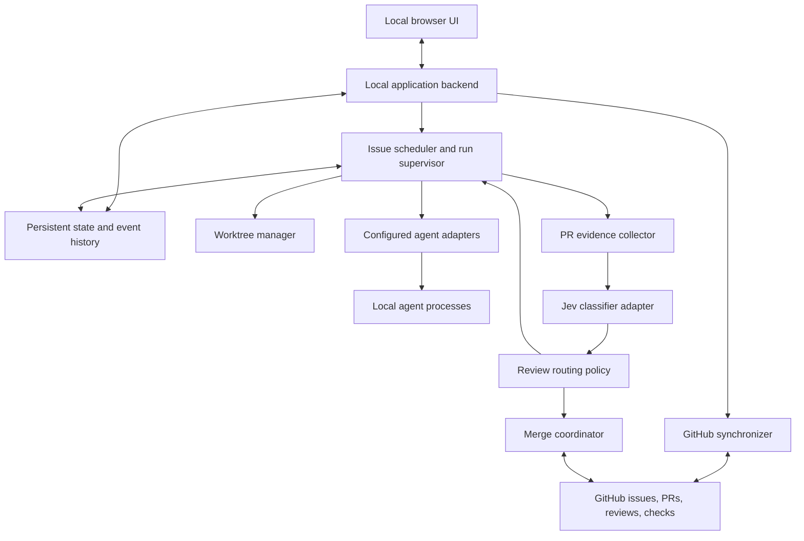

# Architecture proposal

Status: component boundaries and stack recommendations are proposed. No stack has been selected.

## Stack alternatives

| Option | Proposed combination | Benefits | Costs |
| --- | --- | --- | --- |
| A | TypeScript, Node.js, Fastify backend, React/Vite UI, SQLite | One language across UI/backend; suitable for subprocess/event orchestration. | Requires JavaScript tooling; subprocess lifecycle still needs explicit design. |
| B | Python, FastAPI backend, React/Vite UI, SQLite | Python orchestration and typed API validation; familiar ecosystem for model integrations. | Two languages and separate frontend/backend toolchains. |
| C | Python, FastAPI backend, server-rendered UI, SQLite | Smaller frontend surface and fewer build tools. | Rich live logs and interactive review need additional browser-side work. |

Recommendation: A if there is no language preference, because this product's main work is web interaction, process supervision, and API integration. SQLite is proposed for local durable state; it is not selected. No external queue/service is proposed for the MVP. Framework versions, database tooling, frontend libraries, package manager, and packaging will be chosen only after stack selection.

Framework references: [Fastify](https://fastify.dev/docs/latest/), [FastAPI](https://fastapi.tiangolo.com/). These are options, not performance claims.

## Proposed components

All local components are proposed to run under the application's supervised lifecycle. No independent background daemon is proposed. Outbound GitHub synchronization and Jev calls do not require a publicly reachable local server if polling is chosen.

| Component | Responsibility |
| --- | --- |
| GitHub synchronizer | Read issues/PRs/reviews/checks, publish agreed labels/comments, reconcile external changes and incomplete writes. |
| Scheduler | Claim eligible Ready issues, enforce configurable capacity, schedule implementation/rework/review. |
| Run supervisor | Spawn/cancel agent processes, record events/results, manage timeouts and app shutdown. |
| Worktree manager | Maintain a factory-owned clone and one worktree per active issue cycle; preserve human checkouts. |
| Agent adapters | Translate the factory's task/review contracts into the user's configured tool interface. |
| Evidence collector | Capture actual diff, scope, checks, commands, and relevant context for the PR revision. |
| Jev adapter and policy | Request bounded decisions, preserve answers, apply the agreed routing policy. |
| Merge coordinator | Recheck current PR/review/check state, perform a permitted merge, confirm the result. |
| Persistent store | Keep configuration, claims, attempts, feedback, revision-bound decisions, and synchronization operations. |

Whether the factory or agent creates commits, pushes branches, and opens PRs requires a decision. Recommendation: factory owns these actions so agent completion cannot accidentally skip workflow checks.

## Proposed data model

Logical entities, not a settled database schema:

- Repository connection: stable GitHub identity, owner/name, target branch, clone location, capability checks, sync cursor.
- Agent profile: executable/interface, role, version, model/configuration references, supported capabilities.
- Issue: GitHub identity, scope snapshot, stage, blocked reason, external revision.
- Issue cycle: distinguishes a later reopening from earlier merged work; branch, worktree, current PR.
- Run attempt: role, status, process/thread identifiers, input revision, timestamps, logs, structured result.
- Review finding/handoff: reviewed revision, findings, verification evidence, requested changes, source.
- Classification: head/base revision, model version, rubric/policy version, answers/probabilities, chosen route.
- GitHub operation: intended side effect, reconciliation key, status, remote result.
- Event: state/action changes with actor, time, reason, and relevant entity identifiers.

Proposed constraints: one active connected repository, one active execution claim per issue cycle, one active PR per issue, and one merge operation at a time for the repository. Issues may implement concurrently; merge serialization reduces changes to the shared target branch during merge checks.

## Concurrency and recovery — proposed

Issue worktrees isolate files but share Git repository data. Git explicitly allows shared repository state across worktrees; a worktree is not a process/container isolation boundary. [Git worktree documentation](https://git-scm.com/docs/git-worktree).

Keep worktree paths/branches unique; serialize shared Git maintenance where needed. Separate application metadata transactions from remote GitHub writes. Save the intended remote operation before making it, and reconcile its result before retrying to avoid duplicate PRs/comments after an interrupted request.

On startup, inspect retained worktrees, process records, and GitHub PRs before claiming work. Reconcile completed merges and existing PRs before recreating anything. Preserve uncommitted work after interruptions. Automatic versus manual restart is open.

Shutdown proposal: stop accepting new work, stop owned agent processes, persist interrupted attempts, and retain worktrees for restart. Closing a browser tab versus stopping the backend is not yet defined. Timeouts, graceful shutdown period, child-process cleanup, and sleep/wake handling remain open.

## Contracts to specify after decisions

REST or other UI API, live-event transport, configuration schema, agent task/result schemas, SQLite migrations, state transition API, operation reconciliation keys, and local storage layout. None is silently selected by this document.
