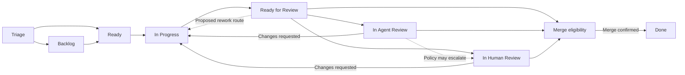

# Issue and PR workflow

Status: proposed except where explicitly identified as confirmed.

## State representation — proposed

Use namespaced GitHub issue labels for the externally visible lifecycle and a local persistent record for execution details. This avoids requiring a GitHub Project for onboarding. Exact label names are open; the display stages below are proposals.

Triage and Backlog remain human-owned. A Ready label is the explicit authorization for new implementation. The factory manages execution-stage labels. It maintains one lifecycle label per managed issue and leaves unrelated labels alone.

Represent Blocked as an additional flag with reason, actor, timestamp, dependency/information needed, and the stage to resume. Keep the lifecycle stage visible. Queued versus actively running review is execution metadata, avoiding separate Needs Review labels.

## Proposed stages

| Stage | Meaning | Exit |
| --- | --- | --- |
| Triage | Human defines and evaluates the issue. | Human sends to Backlog or Ready, or closes without completion. |
| Backlog | Accepted but not authorized for execution. | Human marks Ready. |
| Ready | Authorized and waiting for capacity/preflight. | Successful claim and preflight start implementation. |
| In Progress | Implementation or review-driven rework. | Usable PR and verification evidence become ready for classification. |
| Ready for Review | Jev classification is pending/in progress. | Agreed policy chooses direct merge, agent review, human review, or rework. |
| In Agent Review | Agent review is queued or active. | Pass enters merge eligibility or human review according to policy; failure returns to implementation. |
| In Human Review | Human review is waiting or active. | Approval enters merge eligibility; requested changes return to implementation. |
| Done | Linked PR is confirmed merged and agreed completion checks passed. | Human may reopen the issue. |

The classification stage is proposed because the brief explicitly requires evaluating ready-for-review PRs. Whether to expose it as a label or only PR/run metadata remains open.

Merge eligibility is an internal gate, not a proposed extra issue label. Jev routing cannot establish a GitHub merge happened.

## Review feedback — confirmed behaviour, proposed record

A failed review automatically returns to implementation with additional context. Proposed rework handoff fields:

- Issue scope/acceptance criteria and their current revision.
- Existing branch, worktree, PR, and reviewed head/base commit identifiers.
- Implementation summary and earlier attempts.
- Findings with file/location, expected behaviour, observed behaviour, and evidence.
- Commands run, results, outstanding checks, and changes requested.
- Whether the finding came from a human, agent, or an agreed classification rule.

Proposed: preserve the existing PR and branch for rework, start a fresh implementation attempt, and review/classify the updated revision again. Review approvals and classification results apply only to the evaluated revision. No second active PR is created. Whether to resume the same agent conversation is open.

## Blocking — proposed

Block an affected issue when README commands are missing/ambiguous, clarification or dependencies are required, permissions/toolchains prevent execution, retry limits are exhausted, or a conflicting active PR exists. Record a specific next action. Unblocking requires checking that the cause was resolved, then returning to the retained stage; it does not mean marking Done.

Missing README instructions must block execution before implementation starts (confirmed). Exactly which other failures block, pause, or retry remains open.

## Edge cases requiring decisions

- Human edits scope, removes Ready, changes labels, or closes an issue during a run.
- A human creates a second PR or modifies the factory branch outside the app.
- PR is closed without merging, or an issue is reopened after an unmerged closure.
- Previously merged issue is reopened: create a new issue cycle, but only after an agreed readiness gate. Reopening alone is not assumed authorization.
- PR has no diff, targets a different branch, or cannot merge because another issue landed first.
- Review is stale after branch updates, base branch updates, or policy changes.
- GitHub auto-closes an issue before the factory's Done conditions are satisfied.
- Duplicate/declined/cancelled issues need a resolution distinct from completed delivery.

Transition permissions, reconciliation authority, and terminal resolutions are open decisions.
